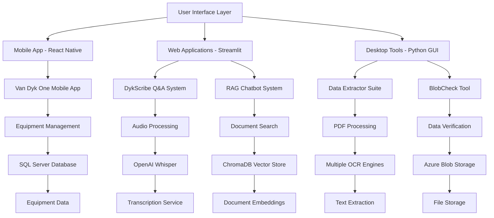

# Complete Project Portfolio Overview - Ajith Srikanth

## 🎯 Portfolio Summary

This document provides a comprehensive overview of all projects developed by Ajith Srikanth during their internship. The portfolio demonstrates expertise in multiple technologies including mobile development, web applications, AI/ML systems, data processing, and cloud services.

## 📊 Project Classification

### By Technology Stack:
- **Mobile Development**: 1 project (React Native)
- **Web Applications**: 2 projects (Streamlit, Web-based)
- **AI/ML Systems**: 3 projects (RAG, OCR, AI Chatbots)
- **Data Processing**: 4 projects (Data Extractor, BlobCheck, OCR Tools)
- **Cloud Services**: 2 projects (Azure Blob Storage, SQL Server)

### By Complexity Level:
- **Beginner**: 2 projects (Basic mobile app, Simple OCR tools)
- **Intermediate**: 3 projects (Data Extractor, BlobCheck, OCR Suite)
- **Advanced**: 2 projects (DykScribe, RAG System)

### By Business Value:
- **High Impact**: 3 projects (DykScribe, RAG System, Data Extractor)
- **Medium Impact**: 2 projects (BlobCheck, OCR Suite)
- **Learning/Development**: 2 projects (Mobile App, Standalone Chatbots)

## 🏗️ Project Architecture Overview

## 📱 Project 1: Van Dyk One Mobile App

**Type**: Cross-Platform Mobile Application  
**Technology**: React Native + TypeScript  
**Status**: Development Phase  
**Complexity**: Intermediate  

### What It Does:
A mobile application for Van Dyk service technicians to manage equipment, track expenses, handle service tickets, and manage sites.

### Key Features:
- Equipment management and tracking
- Service ticket handling
- Expense tracking and reporting
- Site management capabilities
- Cross-platform compatibility (iOS, Android, Web)

### Technical Highlights:
- React Native 0.80.0 with TypeScript
- Tab-based navigation system
- Modular component architecture
- Cross-platform deployment

### Learning Value:
- Mobile development fundamentals
- Cross-platform development
- Component-based architecture
- State management concepts

---

## 🔍 Project 2: BlobCheck

**Type**: Data Verification Tool  
**Technology**: Python + Azure + SQL Server  
**Status**: Production Ready  
**Complexity**: Intermediate  

### What It Does:
Verifies data consistency between Azure Blob Storage and SQL Server database, identifying missing files and data discrepancies.

### Key Features:
- Automated data verification
- CSV report generation
- Path normalization and comparison
- Error handling and logging

### Technical Highlights:
- Azure Blob Storage integration
- SQL Server connectivity
- Intelligent path normalization
- Comprehensive error handling

### Learning Value:
- Cloud services integration
- Database operations
- Data validation techniques
- Error handling strategies

---

## 📄 Project 3: Data Extractor Suite

**Type**: PDF Processing and OCR Toolkit  
**Technology**: Python + Multiple AI Libraries  
**Status**: Production Ready  
**Complexity**: Advanced  

### What It Does:
Comprehensive PDF processing toolkit that extracts structured data using multiple OCR and AI techniques.

### Key Features:
- Multiple extraction methods (LayoutParser, OpenCV, LLM, OpenRouter)
- Batch processing capabilities
- GUI interface for easy use
- Multiple output formats

### Technical Highlights:
- Integration of multiple OCR engines
- AI-powered data extraction
- Advanced computer vision
- Parallel processing

### Learning Value:
- Computer vision concepts
- OCR technology
- AI/ML integration
- GUI development

---

## 🎤 Project 4: DykScribe

**Type**: Web-based Q&A System  
**Technology**: Streamlit + OpenAI + SQL Server  
**Status**: Production Ready  
**Complexity**: Advanced  

### What It Does:
Streamlined Q&A and information capture system for Van Dyk service technicians with audio recording, transcription, and intelligent processing.

### Key Features:
- Audio recording and upload
- Automatic transcription using Whisper
- AI-powered Q&A extraction
- Equipment management integration
- PDF manual upload

### Technical Highlights:
- OpenAI API integration
- Real-time audio processing
- Dynamic equipment management
- Database integration

### Learning Value:
- Web application development
- AI service integration
- Audio processing
- Database design

---

## 🤖 Project 5: RAG System

**Type**: AI-Powered Chatbot and Document Search  
**Technology**: Python + Multiple AI Libraries + Vector Database  
**Status**: Production Ready  
**Complexity**: Advanced  

### What It Does:
Intelligent chatbot that combines document search, database queries, and AI to provide comprehensive answers about equipment and maintenance.

### Key Features:
- Vector-based document search
- Hybrid search capabilities
- AI-powered response generation
- Vanna AI integration
- Comprehensive analytics

### Technical Highlights:
- ChromaDB vector database
- Multiple AI model integration
- Hybrid search architecture
- Real-time processing

### Learning Value:
- AI/ML concepts
- Vector databases
- Natural language processing
- System architecture

---

## 🔧 Project 6: OCR Tools Collection

**Type**: OCR Processing Scripts  
**Technology**: Python + Multiple OCR Libraries  
**Status**: Production Ready  
**Complexity**: Intermediate  

### What It Does:
Collection of OCR processing scripts for various document types and processing requirements.

### Key Features:
- Multiple OCR engines
- Batch processing
- File organization
- Result validation

### Technical Highlights:
- PaddleOCR integration
- Tesseract implementation
- OpenCV processing
- Automated workflows

### Learning Value:
- OCR technology
- Image processing
- Automation concepts
- File handling

---

## 🗣️ Project 7: Standalone Chatbot Files

**Type**: AI Chatbot Implementations  
**Technology**: Python + OpenAI + Streamlit  
**Status**: Development/Testing  
**Complexity**: Intermediate  

### What It Does:
Various chatbot implementations for different use cases and testing purposes.

### Key Features:
- Multiple chatbot variants
- Different AI model integrations
- Testing and experimentation
- Learning and development

### Technical Highlights:
- OpenAI API usage
- Streamlit integration
- Chatbot architecture
- AI model experimentation

### Learning Value:
- Chatbot development
- AI model usage
- API integration
- Experimentation techniques

---

## 🎓 Educational Value and Learning Outcomes

### Technical Skills Developed:
1. **Programming Languages**: Python, TypeScript, JavaScript
2. **Frameworks**: React Native, Streamlit, Tkinter
3. **Databases**: SQL Server, ChromaDB, Vector Databases
4. **Cloud Services**: Azure Blob Storage, OpenAI API
5. **AI/ML**: OCR, NLP, Vector Search, LLM Integration
6. **Mobile Development**: Cross-platform development
7. **Web Development**: Full-stack web applications

### Soft Skills Developed:
1. **Problem Solving**: Complex technical challenges
2. **System Design**: Architecture and integration
3. **Documentation**: Comprehensive project documentation
4. **Testing**: Quality assurance and validation
5. **Deployment**: Production system deployment

### Industry-Relevant Experience:
1. **Enterprise Software**: Business-critical applications
2. **AI Integration**: Modern AI/ML technologies
3. **Cloud Services**: Scalable cloud solutions
4. **Data Processing**: Large-scale data handling
5. **User Experience**: Professional UI/UX design

## 🚀 Career Readiness Assessment

### Strengths Demonstrated:
- **Technical Versatility**: Multiple technology stacks
- **Problem-Solving**: Complex system integration
- **Learning Agility**: Rapid technology adoption
- **Documentation**: Professional documentation skills
- **Project Management**: End-to-end project delivery

### Areas for Growth:
- **Team Collaboration**: More team-based projects
- **Testing**: Comprehensive testing strategies
- **Performance**: Optimization techniques
- **Security**: Security best practices
- **Scalability**: Large-scale system design

## 🔮 Future Development Recommendations

### Immediate Next Steps:
1. **Portfolio Website**: Create professional portfolio website
2. **GitHub Repository**: Organize and document all projects
3. **Live Demos**: Deploy projects for demonstration
4. **Case Studies**: Write detailed case studies
5. **Video Presentations**: Create project walkthrough videos

### Long-term Development:
1. **Advanced AI**: Explore more advanced AI techniques
2. **Cloud Architecture**: Learn cloud architecture patterns
3. **DevOps**: Implement CI/CD and deployment automation
4. **Mobile Apps**: Develop more mobile applications
5. **Open Source**: Contribute to open source projects

## 📚 Learning Resources and Recommendations

### Technical Learning:
- **AI/ML**: Coursera AI courses, OpenAI documentation
- **Cloud Services**: Azure and AWS certifications
- **Mobile Development**: React Native documentation
- **Database**: SQL Server and vector database courses
- **Web Development**: Full-stack development courses

### Professional Development:
- **Portfolio Building**: GitHub, LinkedIn, personal website
- **Networking**: Tech meetups, conferences, online communities
- **Certifications**: Cloud, AI, and development certifications
- **Internships**: Additional internship opportunities
- **Projects**: Personal projects and open source contributions

## 🎯 Conclusion

This portfolio demonstrates significant technical growth and practical experience in modern software development. The projects show progression from basic concepts to advanced AI/ML integration, indicating strong learning ability and technical aptitude.

The combination of mobile development, web applications, AI/ML systems, and data processing provides a well-rounded foundation for a career in software development, with particular strength in AI integration and full-stack development.

The comprehensive documentation and production-ready implementations show professional-level work quality and attention to detail, making this portfolio suitable for university applications and entry-level software development positions.

---

*This portfolio overview provides a comprehensive understanding of all projects, their technical implementation, and educational value in terms accessible to someone transitioning from high school to university level.*
