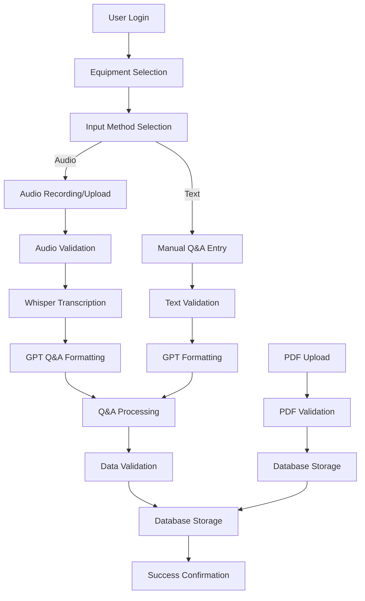

# DykScribe Project - Complete Documentation

## 🎤 Project Overview

**Project Name:** DykScribe  
**Project Type:** Web-based Q&A and Information Capture System  
**Technology Stack:** Streamlit with OpenAI Integration  
**Purpose:** Streamlined Q&A and information capture form for Van Dyk service technicians  
**Development Status:** Production Ready (Version 2)  

## 🎯 What This Project Does

DykScribe is a sophisticated web application designed to capture and process technical Q&A sessions from Van Dyk service technicians. It combines audio recording, transcription, and intelligent data processing to create structured information that can be stored and analyzed.

### Key Features:
1. **Audio Recording** - Record Q&A sessions directly in the browser
2. **Audio Upload** - Upload pre-recorded audio files (MP3/WAV)
3. **Automatic Transcription** - Convert audio to text using OpenAI Whisper
4. **Intelligent Q&A Extraction** - Use AI to structure Q&A pairs from transcripts
5. **Equipment Management** - Track equipment types, manufacturers, and models
6. **PDF Manual Upload** - Attach equipment manuals and documentation
7. **Database Integration** - Store all data in SQL Server database
8. **User Management** - Role-based access and user tracking

## 🏗️ Technical Architecture

### Technology Stack:
- **Frontend Framework**: Streamlit (Python web framework)
- **Backend Language**: Python 3.x
- **Database**: SQL Server (Azure SQL Database)
- **AI Services**: OpenAI API (Whisper for transcription, GPT for Q&A formatting)
- **Audio Processing**: Streamlit Audio Recorder
- **File Handling**: In-memory processing (no temporary files)
- **Authentication**: Database-based user management

### Project Structure:
```
DykScribe Final - V2/
├── app.py                          # Main Streamlit application
├── app_secrets.py                  # Secret configuration management
├── db_engine.py                    # Database connection and management
├── openai_client.py                # OpenAI API client configuration
├── requirements.txt                # Python dependencies
├── README.md                       # Project documentation
├── .env                           # Environment variables
├── .gitignore                     # Git ignore configuration
├── utils/                         # Utility modules
│   ├── db.py                      # Database utilities
│   └── ai.py                      # AI processing utilities
├── st_audiorec/                   # Audio recording component
├── streamlit-audio-recorder-main/ # Audio recording library
├── .streamlit/                    # Streamlit configuration
└── .devcontainer/                 # Development container setup
```

## 🔧 Working Principles

### 1. Multi-Input Processing System
DykScribe supports two primary input methods:

**Audio Input**:
- **Browser Recording**: Direct audio recording using device microphone
- **File Upload**: Upload pre-recorded MP3 or WAV files
- **Format Support**: MP3, WAV audio formats
- **Size Limits**: Up to 200MB for audio files

**Text Input**:
- **Manual Entry**: Type Q&A pairs directly
- **Format Validation**: Ensures proper Q&A format (Q1:/A1: or Q:/A:)
- **Real-time Validation**: Immediate feedback on input format

### 2. Intelligent Audio Processing
The system implements advanced audio processing capabilities:

**Enhanced Transcription**:
- Uses OpenAI Whisper model for high-accuracy transcription
- Optimized for technical terminology and equipment discussions
- No temporary files - all processing in memory
- Retry mechanism for failed transcriptions

**AI-Powered Q&A Extraction**:
- Uses GPT-4 to structure transcripts into Q&A pairs
- Focuses on technical discussions and equipment details
- Filters out filler words and irrelevant content
- Maintains technical accuracy and precision

### 3. Dynamic Equipment Management
The system provides intelligent equipment data management:

**Hierarchical Data Structure**:
- Equipment Type → Manufacturer → Model → Specifications
- Dynamic dropdown population based on selections
- Support for custom entries and new equipment types
- Real-time data validation and formatting

**Database Integration**:
- Real-time data fetching from SQL Server
- Caching for improved performance
- Error handling and fallback mechanisms
- Support for custom equipment additions

## 📊 Data Flow



## 🚀 Getting Started

### Prerequisites:
- Python 3.7 or higher
- Streamlit framework
- SQL Server database access
- OpenAI API key
- Required Python packages

### Installation Steps:

1. **Clone the repository**
   ```bash
   git clone <repository-url>
   cd "DykScribe Final - V2"
   ```

2. **Install dependencies**
   ```bash
   pip install -r requirements.txt
   ```

3. **Configure environment variables**
   ```bash
   # Create .env file with:
   OPENAI_API_KEY=your-openai-api-key
   DATABASE_CONNECTION_STRING=your-database-connection
   ```

4. **Set up database**
   - Ensure SQL Server database is accessible
   - Verify user permissions and table structure
   - Test database connection

5. **Run the application**
   ```bash
   streamlit run app.py
   ```

## 🔧 Core Components

### 1. Main Application (`app.py`)
The primary Streamlit application with comprehensive functionality:

**Key Features**:
- User authentication and role management
- Equipment selection and management
- Audio recording and processing
- Text input and validation
- PDF upload and processing
- Database integration and storage

**User Interface**:
- Clean, professional design with Van Dyk branding
- Responsive layout for different screen sizes
- Real-time feedback and validation
- Comprehensive error handling and user guidance

### 2. Database Engine (`db_engine.py`)
Handles all database operations and connections:

**Functions**:
- Database connection management
- Query execution and result processing
- Error handling and connection recovery
- Data validation and sanitization

**Database Tables**:
- `QAForms` - Main form submissions
- `vw_ActivePM_FSE_Users` - User management
- `vw_EquipmentTypes` - Equipment type data
- `vw_Models` - Equipment model data
- `vw_ModelSpecifications` - Equipment specifications

### 3. OpenAI Client (`openai_client.py`)
Manages OpenAI API interactions:

**Services**:
- Whisper API for audio transcription
- GPT API for Q&A formatting
- Error handling and retry logic
- Cost tracking and usage monitoring

### 4. Utility Modules (`utils/`)
Supporting modules for specific functionality:

**Database Utilities (`db.py`)**:
- Connection string management
- Query execution helpers
- Data validation functions

**AI Utilities (`ai.py`)**:
- OpenAI client configuration
- API call management
- Response processing

## 📋 Key Features

### 1. User Management
- **Role-based Access**: Different access levels for different user types
- **User Authentication**: Database-driven user management
- **Session Management**: Secure session handling
- **Auto-fill Information**: Automatic role and user data population

### 2. Equipment Management
- **Dynamic Dropdowns**: Equipment data loaded from database
- **Hierarchical Selection**: Type → Manufacturer → Model → Specifications
- **Custom Entries**: Support for new equipment types and models
- **Real-time Validation**: Immediate feedback on selections

### 3. Audio Processing
- **Browser Recording**: Direct audio recording in browser
- **File Upload**: Support for MP3 and WAV files
- **Enhanced Transcription**: OpenAI Whisper with technical optimization
- **No Temporary Files**: All processing in memory for security

### 4. AI-Powered Processing
- **Intelligent Q&A Extraction**: GPT-4 for structuring Q&A pairs
- **Technical Focus**: Optimized for equipment and service discussions
- **Quality Filtering**: Removes irrelevant content and filler words
- **Format Standardization**: Consistent Q&A format output

### 5. Data Validation
- **Input Validation**: Comprehensive input checking
- **File Validation**: PDF and audio file validation
- **Data Sanitization**: Security-focused input cleaning
- **Error Handling**: Graceful error management and user feedback

### 6. Database Integration
- **Real-time Data**: Live database queries and updates
- **Caching**: Performance optimization with data caching
- **Error Recovery**: Robust error handling and recovery
- **Data Integrity**: Comprehensive data validation and storage

## 🛠️ Configuration

### Environment Variables:
```python
# OpenAI Configuration
OPENAI_API_KEY = "your-openai-api-key"

# Database Configuration
DATABASE_CONNECTION_STRING = "your-database-connection-string"

# Application Configuration
MAX_AUDIO_SIZE = 200 * 1024 * 1024  # 200MB
MAX_PDF_SIZE = 25 * 1024 * 1024     # 25MB
```

### Database Configuration:
```python
# SQL Server Connection
SERVER = "vdrsapps.database.windows.net"
DATABASE = "PowerAppsDatabase"
USERNAME = "VDRSAdmin"
PASSWORD = "your-password"
```

### Streamlit Configuration:
```python
# Page Configuration
st.set_page_config(
    page_title="DykScribe",
    page_icon="🎤",
    layout="centered",
    initial_sidebar_state="auto"
)
```

## 📊 Data Processing

### 1. Audio Processing Workflow
1. **Audio Input**: User records or uploads audio
2. **Validation**: Check file size and format
3. **Transcription**: Use Whisper API for text conversion
4. **Q&A Extraction**: Use GPT-4 to structure Q&A pairs
5. **Validation**: Check Q&A format and content
6. **Storage**: Save to database with metadata

### 2. Text Processing Workflow
1. **Text Input**: User types Q&A pairs
2. **Validation**: Check format and content
3. **Formatting**: Use GPT for standardization
4. **Validation**: Final format and content check
5. **Storage**: Save to database with metadata

### 3. Equipment Data Processing
1. **Type Selection**: User selects equipment type
2. **Manufacturer Selection**: Load manufacturers for type
3. **Model Selection**: Load models for manufacturer
4. **Specification Selection**: Load specifications for model
5. **Custom Entry**: Allow new entries if needed

## 🔍 User Interface

### 1. Main Interface
- **Header**: Van Dyk logo and branding
- **User Selection**: Dropdown for user selection
- **Equipment Form**: Dynamic equipment selection
- **Input Tabs**: Audio and Text input options
- **Submission**: Final submission and confirmation

### 2. Audio Tab
- **Recording Interface**: Start/stop recording controls
- **File Upload**: Upload pre-recorded audio
- **Validation**: Real-time file validation
- **Processing**: Transcription and Q&A extraction

### 3. Text Tab
- **Text Area**: Large text input for Q&A pairs
- **Format Guide**: Instructions for proper format
- **Validation**: Real-time format validation
- **Processing**: AI-powered formatting

### 4. Results Display
- **Processing Results**: Show extracted Q&A pairs
- **Metadata**: Display processing statistics
- **Confirmation**: Final submission confirmation
- **Reset Option**: Start new submission

## 🧪 Testing and Validation

### Unit Testing:
- Test individual functions and components
- Test data validation and processing
- Test error handling and recovery

### Integration Testing:
- Test end-to-end workflows
- Test database integration
- Test AI service integration

### User Acceptance Testing:
- Test user interface and experience
- Test different user scenarios
- Test error handling and recovery

## 🚀 Deployment

### Development Environment:
1. **Local Setup**: Install dependencies and configure
2. **Database Setup**: Configure local database
3. **API Keys**: Set up OpenAI API access
4. **Testing**: Run comprehensive test suite

### Production Environment:
1. **Server Setup**: Configure production server
2. **Database Setup**: Set up production database
3. **Security**: Implement security measures
4. **Monitoring**: Set up logging and monitoring

## 🔮 Future Enhancements

### Planned Features:
- Mobile app version
- Offline functionality
- Advanced analytics
- Integration with other systems

### Technical Improvements:
- Performance optimization
- Enhanced security
- Better error handling
- Additional AI models

## 🐛 Known Issues

### Current Limitations:
- Requires internet connection for AI services
- Limited offline functionality
- Basic error handling
- Single-user sessions

### Technical Debt:
- Need for better error handling
- Limited logging capabilities
- Basic performance monitoring
- Manual configuration required

## 📞 Support and Maintenance

### Development Team:
- Primary Developer: Ajith Srikanth
- Database Administrator: VDRS Team
- AI Specialist: OpenAI Integration Team

### Maintenance Schedule:
- Regular updates for bug fixes
- Feature releases every quarter
- Security updates as needed
- Performance optimizations

## 📚 Additional Resources

### Documentation:
- Streamlit Documentation
- OpenAI API Documentation
- SQL Server Documentation
- Python Web Development Guide

### Tools:
- Streamlit development tools
- Database management tools
- API testing tools
- Performance monitoring tools

---

*This documentation provides a comprehensive understanding of the DykScribe project, explaining both the technical implementation and practical usage in terms accessible to someone transitioning from high school to university level.*
