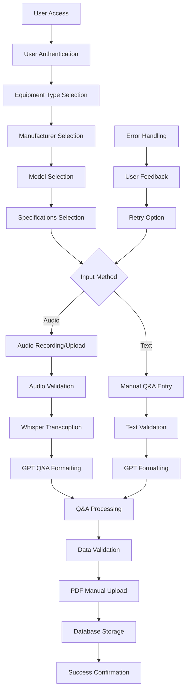
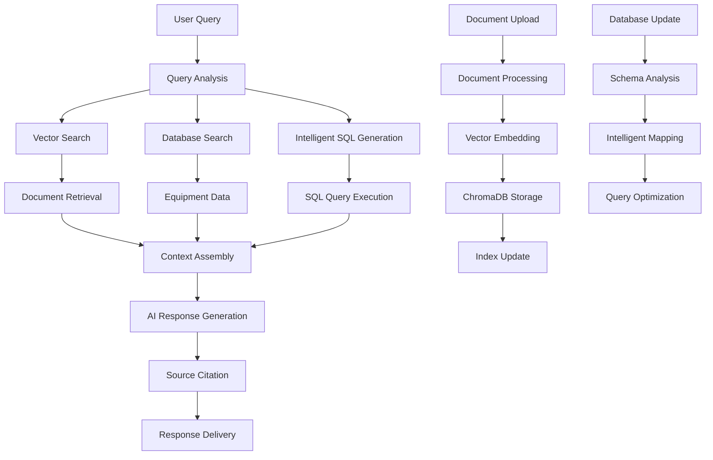
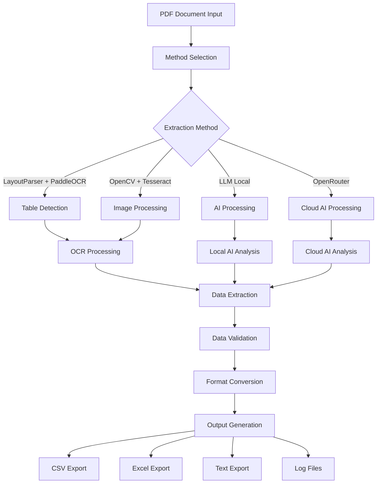
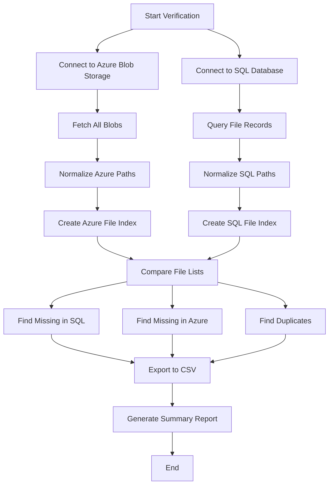
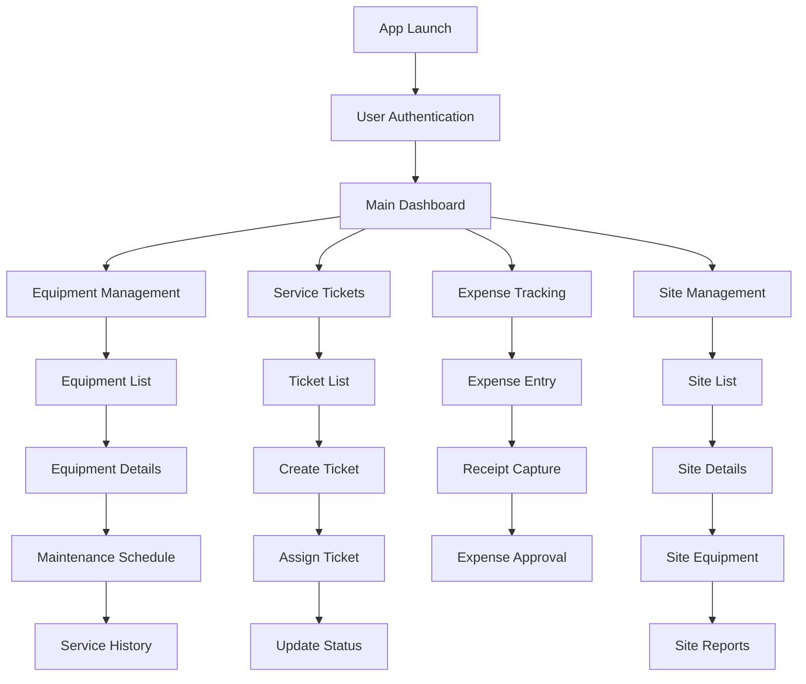
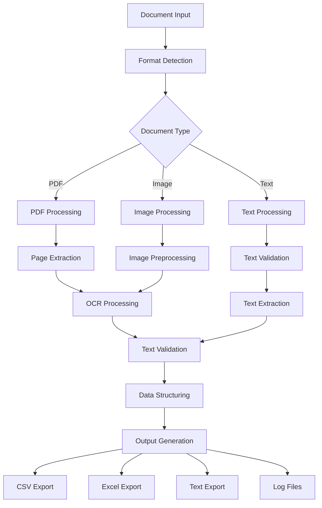
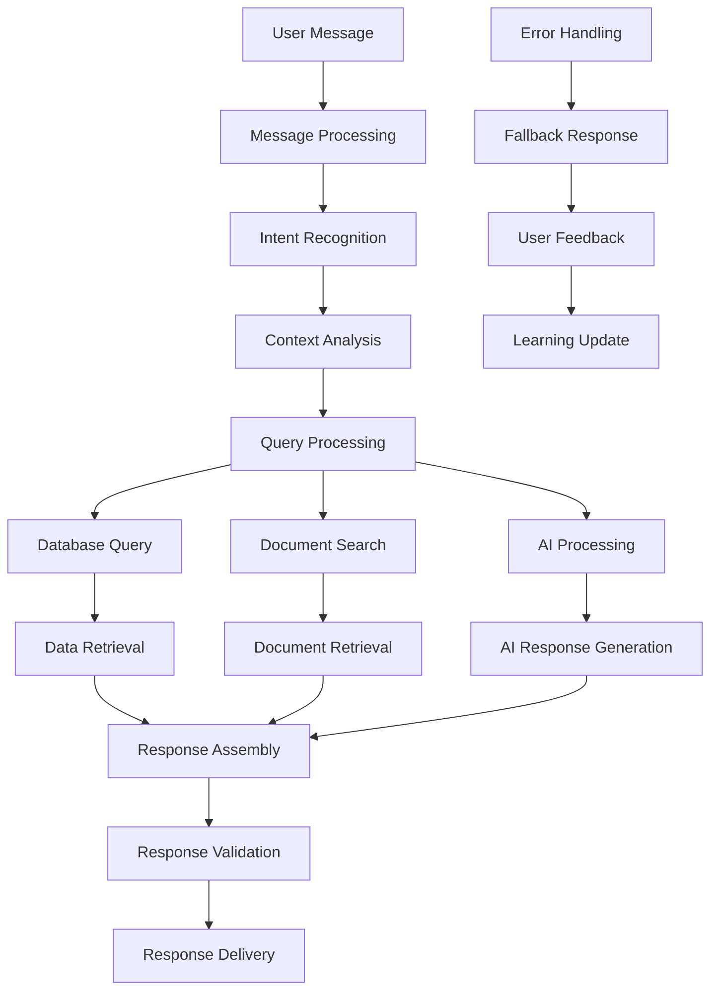
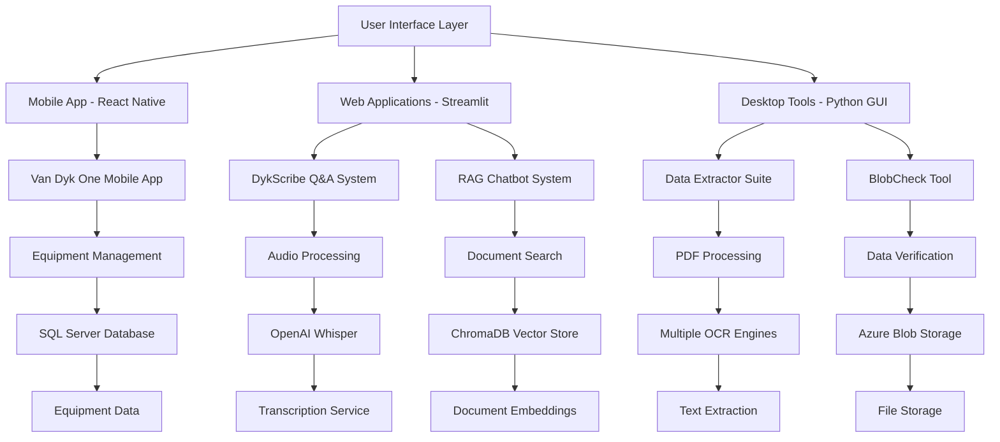
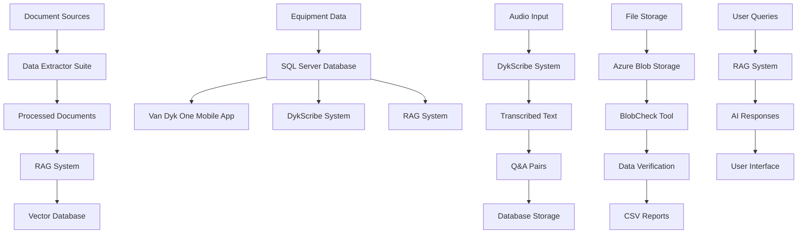
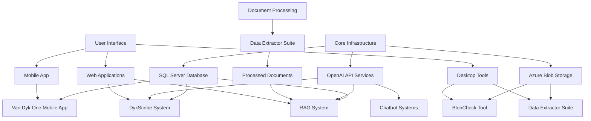

# Project Flowcharts and Working Principles

## 🎤 DykScribe Project Flowchart

## 🤖 RAG System Flowchart

## 📄 Data Extractor Suite Flowchart

## 🔍 BlobCheck Project Flowchart

## 📱 Van Dyk One Mobile App Flowchart

## 🔧 OCR Tools Collection Flowchart

## 🗣️ Chatbot System Flowchart

## 🏗️ Overall System Architecture

## 🔄 Data Flow Between Projects

## 📊 Project Dependencies and Relationships

---

*These flowcharts provide visual representations of how each project works, showing the data flow, decision points, and system interactions. They help understand the working principles and technical implementation of each project in a clear, visual format.*
