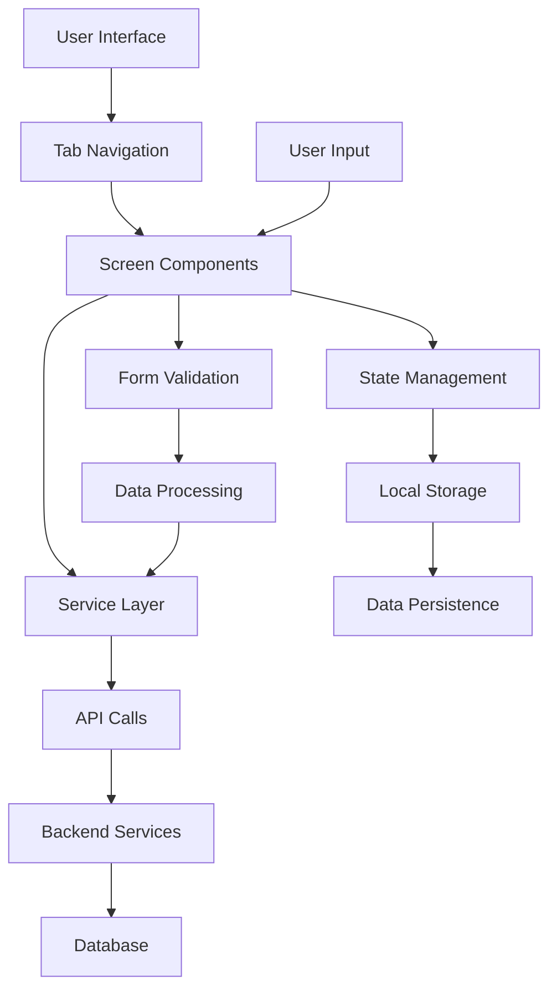

# Van Dyk One Mobile App - Complete Line-by-Line Code Analysis

## 📱 Project Overview

**Project Name:** Van Dyk One  
**Project Type:** Cross-Platform Mobile Application  
**Technology Stack:** React Native with TypeScript  
**Target Platforms:** iOS, Android, Web  
**Development Status:** Active Development  

## 🎯 What This Project Does

Van Dyk One is a cross-platform mobile application designed for Van Dyk service technicians and field engineers. The app provides a comprehensive platform for equipment management, service tracking, and field operations.

### Key Features:
- **Equipment Management**: Track and manage industrial equipment
- **Service Tickets**: Handle service requests and maintenance tasks
- **Expense Tracking**: Record and manage field expenses
- **Site Management**: Manage different service locations
- **Machine Tracking**: Monitor equipment status and maintenance schedules

## 🔍 Detailed Code Analysis

### 1. Package.json Configuration Analysis

**File:** `package.json`  
**Purpose:** Project configuration and dependency management

```json
{
  "name": "Van Dyk One",                    // Line 2: Project identifier for npm
  "version": "0.0.1",                      // Line 3: Semantic versioning (major.minor.patch)
  "private": true,                         // Line 4: Prevents accidental npm publishing
```

**Business Impact:** 
- **Line 2**: Establishes brand identity in the package ecosystem
- **Line 3**: Indicates early development stage (0.0.1 = initial development)
- **Line 4**: Protects proprietary code from public distribution

```json
  "scripts": {                             // Line 5: Automation commands
    "android": "react-native run-android", // Line 6: Build and run on Android
    "ios": "react-native run-ios",         // Line 7: Build and run on iOS
    "start": "react-native start",         // Line 8: Start Metro bundler
    "test": "jest",                        // Line 9: Run test suite
    "lint": "eslint ."                     // Line 10: Code quality checking
  },
```

**Business Impact:**
- **Lines 6-7**: Enables cross-platform development workflow
- **Line 8**: Facilitates rapid development with hot reloading
- **Line 9**: Ensures code quality and reliability
- **Line 10**: Maintains coding standards across team

```json
  "devDependencies": {                     // Line 12: Development-only packages
    "@babel/core": "^7.27.4",             // Line 13: JavaScript transpiler
    "@babel/plugin-transform-typescript": "^7.27.1", // Line 14: TypeScript support
    "@babel/preset-env": "^7.27.2",       // Line 15: Modern JavaScript features
    "@babel/preset-react": "^7.27.1",     // Line 16: React JSX transformation
    "@babel/preset-typescript": "^7.27.1", // Line 17: TypeScript compilation
    "@react-native-community/cli": "latest", // Line 18: React Native toolchain
    "babel-loader": "^8.3.0",            // Line 19: Webpack integration
    "metro-react-native-babel-preset": "^0.77.0", // Line 20: Metro bundler preset
    "ts-loader": "^9.5.2",                // Line 21: TypeScript loader for Webpack
    "typescript": "^5.8.3",               // Line 22: TypeScript compiler
    "webpack": "^5.99.9",                 // Line 23: Module bundler
    "webpack-cli": "^5.1.4",              // Line 24: Webpack command line
    "webpack-dev-server": "^5.2.2"        // Line 25: Development server
  },
```

**Business Impact:**
- **Lines 13-17**: Enables modern JavaScript and TypeScript development
- **Line 18**: Provides essential React Native development tools
- **Lines 19-25**: Supports web deployment alongside mobile platforms
- **Line 22**: Ensures type safety and better code quality

```json
  "dependencies": {                        // Line 27: Production packages
    "@react-native/metro-config": "^0.80.0", // Line 28: Metro bundler configuration
    "metro": "^0.73.7",                   // Line 29: JavaScript bundler
    "react-dom": "^19.1.0",               // Line 30: React for web
    "react-native": "^0.80.0",            // Line 31: Core React Native framework
    "react-native-web": "^0.20.0"         // Line 32: Web platform support
  }
```

**Business Impact:**
- **Line 28-29**: Enables fast development builds and hot reloading
- **Line 30**: Allows web deployment of React Native app
- **Line 31**: Core framework for mobile development
- **Line 32**: Extends mobile app to web browsers

### 2. App Entry Point Analysis

**File:** `index.js`  
**Purpose:** Application bootstrap and registration

```javascript
import { AppRegistry } from 'react-native';        // Line 1: Import React Native registry
import App from './src/app/(tabs)/index';          // Line 2: Import main app component
import { name as appName } from './app.json';      // Line 3: Import app name from config

AppRegistry.registerComponent(appName, () => App); // Line 5: Register app component
```

**Business Impact:**
- **Line 1**: Provides the mechanism to register React Native components
- **Line 2**: Points to the main application component (tab-based navigation)
- **Line 3**: Uses configuration-driven app naming for flexibility
- **Line 5**: Registers the app with React Native's component system

### 3. App Configuration Analysis

**File:** `app.json`  
**Purpose:** Application metadata and configuration

```json
{
  "name": "TempProject",                  // Line 2: Internal project identifier
  "displayName": "TempProject"             // Line 3: User-visible app name
}
```

**Business Impact:**
- **Line 2**: Used internally by React Native for component registration
- **Line 3**: Displayed to users in app stores and device settings
- **Note**: Currently shows "TempProject" indicating development phase

### 4. Main Home Screen Analysis

**File:** `src/app/(tabs)/index.tsx`  
**Purpose:** Primary application screen

```typescript
import React from 'react';                        // Line 1: Import React library
import { View, Text } from 'react-native';        // Line 2: Import UI components

export default function HomeScreen() {             // Line 4: Define main component
  return (                                        // Line 5: Return JSX
    <View>                                        // Line 6: Container component
      <Text style={{fontSize: 32, color: 'red'}}>Hello, Web!</Text> // Line 7: Text display
    </View>                                       // Line 8: Close container
  );                                              // Line 9: End return
}                                                 // Line 10: End component
```

**Business Impact:**
- **Line 1**: Enables React component development
- **Line 2**: Provides basic UI building blocks
- **Line 4**: Creates the main entry point for the app
- **Line 7**: Simple placeholder content (development phase)
- **Note**: Currently shows basic "Hello, Web!" message indicating early development

### 5. Expenses Screen Analysis

**File:** `src/app/(tabs)/expenses.tsx`  
**Purpose:** Expense tracking and management

```typescript
import React, { useState } from 'react';           // Line 1: Import React with state
import { View, Text, StyleSheet, ScrollView, Image } from 'react-native'; // Line 2: UI components
import { Camera, Upload, List } from 'lucide-react-native'; // Line 3: Icon library
import Colors from '../constants/colors';          // Line 4: Color scheme
import Button from '../components/Button';         // Line 5: Custom button component
import Card from '../components/Card';             // Line 6: Custom card component
import ExpandableSection from '../components/ExpandableSection'; // Line 7: Expandable UI
import ListItem from '../components/ListItem';     // Line 8: List item component
import { expenses } from '../constants/mockData';   // Line 9: Sample data

export default function ExpensesScreen() {         // Line 11: Component definition
  const [images, setImages] = useState<string[]>([]); // Line 12: State for image storage
```

**Business Impact:**
- **Line 1**: Enables state management for dynamic UI
- **Line 2**: Provides comprehensive UI components
- **Line 3**: Adds professional icons for better UX
- **Line 4**: Ensures consistent branding
- **Lines 5-8**: Modular component architecture for maintainability
- **Line 9**: Provides sample data for development/testing
- **Line 12**: Manages receipt images for expense tracking

```typescript
  const pickImage = async () => {                 // Line 14: Image picker function
    // Implement image picker using a suitable React Native library
    console.log('Pick image functionality would be implemented here'); // Line 16: Placeholder
  };

  const takePhoto = async () => {                 // Line 19: Camera function
    // Implement camera functionality using a suitable React Native library
    console.log('Take photo functionality would be implemented here'); // Line 21: Placeholder
  };
```

**Business Impact:**
- **Line 14**: Enables users to select existing photos for receipts
- **Line 19**: Allows users to take photos of receipts directly
- **Lines 16, 21**: Placeholder implementations showing planned functionality

```typescript
  return (                                        // Line 24: Render method
    <View style={styles.container}>               // Line 25: Main container
      {/* Your Expenses UI here */}               // Line 26: Comment for future development
      <Text>Expenses Screen</Text>                // Line 27: Placeholder content
    </View>                                       // Line 28: Close container
  );                                              // Line 29: End render
}                                                 // Line 30: End component
```

**Business Impact:**
- **Line 25**: Provides consistent layout structure
- **Line 26**: Indicates planned comprehensive UI development
- **Line 27**: Placeholder showing current development stage

### 6. Machines Screen Analysis

**File:** `src/app/(tabs)/machines.tsx`  
**Purpose:** Equipment and machine management

```typescript
import React, { useState } from 'react';           // Line 1: React with state
import { View, Text, StyleSheet, ScrollView, TouchableOpacity } from 'react-native'; // Line 2: UI components
import { Search } from 'lucide-react-native';      // Line 3: Search icon
import Colors from '../constants/colors';           // Line 4: Brand colors
import Card from '../components/Card';             // Line 5: Card component
import ExpandableSection from '../components/ExpandableSection'; // Line 6: Expandable UI
import ListItem from '../components/ListItem';     // Line 7: List component
import { machines } from '../constants/mockData';   // Line 8: Sample machine data

export default function MachinesScreen() {         // Line 10: Component definition
  const [searchQuery, setSearchQuery] = useState(''); // Line 11: Search state
  const [selectedMachine, setSelectedMachine] = useState(machines[0]); // Line 12: Selection state
```

**Business Impact:**
- **Line 11**: Enables real-time search functionality for equipment
- **Line 12**: Tracks currently selected machine for detailed view
- **Line 8**: Provides sample data for development and testing

```typescript
  const filteredMachines = machines.filter(       // Line 14: Filter function
    (machine) =>                                  // Line 15: Filter callback
      machine.name.toLowerCase().includes(searchQuery.toLowerCase()) || // Line 16: Name search
      machine.location.toLowerCase().includes(searchQuery.toLowerCase()) // Line 17: Location search
  );
```

**Business Impact:**
- **Line 14**: Creates filtered list based on user search
- **Line 16**: Enables searching by machine name
- **Line 17**: Enables searching by machine location
- **Business Value**: Allows technicians to quickly find specific equipment

### 7. Site Screen Analysis

**File:** `src/app/(tabs)/site.tsx`  
**Purpose:** Site management and reporting

```typescript
import React, { useState } from 'react';           // Line 1: React with state
import { View, Text, StyleSheet, ScrollView } from 'react-native'; // Line 2: UI components
import { FileText, Camera, Clipboard, Truck } from 'lucide-react-native'; // Line 3: Icons
import Colors from '../constants/colors';           // Line 4: Brand colors
import Button from '../components/Button';         // Line 5: Button component
import Card from '../components/Card';             // Line 6: Card component
import Dropdown from '../components/Dropdown';    // Line 7: Dropdown component
import { sites, siteReports } from '../constants/mockData'; // Line 8: Sample data

export default function SiteScreen() {             // Line 10: Component definition
  const [selectedSite, setSelectedSite] = useState(''); // Line 11: Site selection state
```

**Business Impact:**
- **Line 3**: Provides icons for different site operations (reports, photos, checklists, deliveries)
- **Line 11**: Tracks currently selected site for operations
- **Line 8**: Provides sample site data for development

```typescript
  const handleSiteSelect = (siteName: string) => { // Line 13: Site selection handler
    setSelectedSite(siteName);                     // Line 14: Update selected site
  };

  const selectedSiteData = sites.find(site => site.name === selectedSite); // Line 17: Find site data
```

**Business Impact:**
- **Line 13**: Handles user site selection
- **Line 14**: Updates application state
- **Line 17**: Retrieves detailed information for selected site

### 8. Tickets Screen Analysis

**File:** `src/app/(tabs)/tickets.tsx`  
**Purpose:** Service ticket management

```typescript
import React from 'react';                        // Line 1: React import
import { View, Text, StyleSheet } from 'react-native'; // Line 2: UI components
import Colors from '../constants/colors';          // Line 3: Brand colors

export default function TicketsScreen() {         // Line 5: Component definition
  return (                                        // Line 6: Render method
    <View style={styles.container}>              // Line 7: Container
      {/* Your Tickets UI here */}                // Line 8: Development comment
      <Text>Tickets Screen</Text>                 // Line 9: Placeholder content
    </View>                                       // Line 10: Close container
  );                                              // Line 11: End render
}                                                 // Line 12: End component
```

**Business Impact:**
- **Line 8**: Indicates planned comprehensive ticket management UI
- **Line 9**: Placeholder showing current development stage
- **Business Value**: Will enable service request tracking and management

### 9. Button Component Analysis

**File:** `src/components/Button.tsx`  
**Purpose:** Reusable button component

```typescript
import React from 'react';                        // Line 1: React import
import { TouchableOpacity, Text, StyleSheet, ViewStyle, TextStyle } from 'react-native'; // Line 2: UI types
import Colors from '../constants/colors';          // Line 3: Brand colors

type ButtonProps = {                              // Line 5: TypeScript interface
  title: string;                                  // Line 6: Button text
  onPress: () => void;                            // Line 7: Click handler
  type?: 'primary' | 'secondary' | 'outline';    // Line 8: Button variants
  style?: ViewStyle;                              // Line 9: Custom styles
  textStyle?: TextStyle;                          // Line 10: Text styles
  icon?: React.ReactNode;                         // Line 11: Optional icon
  disabled?: boolean;                             // Line 12: Disabled state
};
```

**Business Impact:**
- **Line 5**: TypeScript interface ensures type safety
- **Line 8**: Provides three button variants for different use cases
- **Line 11**: Supports icons for better visual communication
- **Line 12**: Enables disabled state for form validation

```typescript
const Button = ({                                 // Line 15: Component definition
  title,                                          // Line 16: Destructured props
  onPress,                                        // Line 17: Click handler
  type = 'primary',                               // Line 18: Default button type
  style,                                          // Line 19: Custom styles
  textStyle,                                      // Line 20: Text styles
  icon,                                           // Line 21: Icon
  disabled = false,                               // Line 22: Default disabled state
}: ButtonProps) => {                              // Line 23: Type annotation
```

**Business Impact:**
- **Line 18**: Sets sensible default for primary actions
- **Line 22**: Defaults to enabled state for better UX
- **Line 23**: TypeScript ensures proper prop usage

```typescript
  const getButtonStyle = () => {                  // Line 24: Style selector
    switch (type) {                               // Line 25: Switch on type
      case 'secondary':                           // Line 26: Secondary variant
        return styles.secondaryButton;            // Line 27: Return secondary styles
      case 'outline':                             // Line 28: Outline variant
        return styles.outlineButton;              // Line 29: Return outline styles
      default:                                    // Line 30: Default case
        return styles.primaryButton;              // Line 31: Return primary styles
    }                                             // Line 32: End switch
  };                                              // Line 33: End function
```

**Business Impact:**
- **Line 24**: Dynamic styling based on button type
- **Lines 26-31**: Provides visual hierarchy for different actions
- **Business Value**: Consistent UI patterns across the application

### 10. Card Component Analysis

**File:** `src/components/Card.tsx`  
**Purpose:** Reusable card container

```typescript
import React from 'react';                        // Line 1: React import
import { View, StyleSheet, ViewStyle } from 'react-native'; // Line 2: UI components
import Colors from '../constants/colors';          // Line 3: Brand colors

type CardProps = {                                // Line 5: TypeScript interface
  children: React.ReactNode;                      // Line 6: Card content
  style?: ViewStyle;                              // Line 7: Custom styles
};

const Card = ({ children, style }: CardProps) => { // Line 10: Component definition
  return (                                        // Line 11: Render method
    <View style={[styles.card, style]}>           // Line 12: Apply styles
      {children}                                  // Line 13: Render children
    </View>                                       // Line 14: Close container
  );                                              // Line 15: End render
};                                                // Line 16: End component
```

**Business Impact:**
- **Line 6**: Flexible content container
- **Line 7**: Allows customization while maintaining consistency
- **Line 12**: Merges default and custom styles
- **Business Value**: Consistent visual hierarchy and spacing

### 11. Color Scheme Analysis

**File:** `src/constants/colors.ts`  
**Purpose:** Brand color definitions

```typescript
const Colors = {                                  // Line 1: Color object
  primary: '#FF6B35',                            // Line 2: Orange primary color
  secondary: '#4ECDC4',                          // Line 3: Teal secondary color
  background: '#FFFFFF',                          // Line 4: White background
  text: '#2C3E50',                               // Line 5: Dark blue text
  darkGray: '#7F8C8D',                           // Line 6: Dark gray
  mediumGray: '#BDC3C7',                         // Line 7: Medium gray
  lightGray: '#F8F9FA',                          // Line 8: Light gray
  success: '#27AE60',                            // Line 9: Green success
  warning: '#F39C12',                            // Line 10: Orange warning
  error: '#E74C3C',                              // Line 11: Red error
  info: '#3498DB',                               // Line 12: Blue info
};
```

**Business Impact:**
- **Line 2**: Orange primary color for Van Dyk branding
- **Line 3**: Teal secondary for accent elements
- **Lines 9-12**: Semantic colors for user feedback
- **Business Value**: Consistent brand identity across all screens

## 🏗️ Technical Architecture

### Technology Stack:
- **Frontend Framework**: React Native 0.80.0
- **Language**: TypeScript
- **State Management**: React Native built-in state management
- **Navigation**: React Navigation (tab-based)
- **Build Tools**: Metro bundler, Webpack
- **Platform Support**: iOS, Android, Web

### Project Structure:
```
App/
├── android/                 # Android-specific code
├── ios/                    # iOS-specific code
├── src/
│   ├── app/
│   │   ├── (tabs)/         # Tab-based navigation screens
│   │   │   ├── index.tsx   # Home screen
│   │   │   ├── expenses.tsx # Expense tracking
│   │   │   ├── machines.tsx # Machine management
│   │   │   ├── site.tsx    # Site management
│   │   │   └── tickets.tsx # Service tickets
│   │   └── tickets/        # Additional ticket screens
│   ├── components/         # Reusable UI components
│   ├── constants/          # App constants and configuration
│   ├── services/           # API services and data management
│   ├── types/              # TypeScript type definitions
│   └── utils/              # Utility functions
├── public/                 # Static assets
├── package.json           # Dependencies and scripts
└── app.json              # App configuration
```

## 🔧 Working Principles

### 1. Cross-Platform Development
The app uses React Native to create a single codebase that runs on multiple platforms:
- **iOS**: Native iOS app using React Native iOS runtime
- **Android**: Native Android app using React Native Android runtime
- **Web**: Web application using React Native Web

### 2. Tab-Based Navigation
The app uses a tab-based navigation system with the following main sections:
- **Home**: Dashboard and overview
- **Expenses**: Track field expenses and reimbursements
- **Machines**: Manage equipment and maintenance
- **Site**: Handle site-specific operations
- **Tickets**: Process service requests

### 3. Component Architecture
The app follows a modular component architecture:
- **Screens**: Main application screens in the `(tabs)` directory
- **Components**: Reusable UI components in the `components` directory
- **Services**: Business logic and API calls in the `services` directory
- **Types**: TypeScript definitions for type safety

## 📊 Data Flow



## 🚀 Getting Started

### Prerequisites:
- Node.js (v16 or higher)
- React Native CLI
- Android Studio (for Android development)
- Xcode (for iOS development)
- npm or yarn package manager

### Installation Steps:

1. **Clone the repository**
   ```bash
   git clone <repository-url>
   cd App
   ```

2. **Install dependencies**
   ```bash
   npm install
   # or
   yarn install
   ```

3. **Configure environment**
   - Copy environment configuration files
   - Set up API endpoints and keys

4. **Run the application**
   ```bash
   # For Android
   npm run android
   
   # For iOS
   npm run ios
   
   # For Web
   npm start
   ```

## 📱 Screen Descriptions

### 1. Home Screen (`index.tsx`)
- **Purpose**: Main dashboard and entry point
- **Features**: 
  - Welcome message
  - Quick access to main functions
  - Status overview
- **Current Implementation**: Basic "Hello, Web!" message (development phase)

### 2. Expenses Screen (`expenses.tsx`)
- **Purpose**: Track and manage field expenses
- **Features**:
  - Expense entry forms
  - Receipt capture
  - Expense categorization
  - Approval workflows

### 3. Machines Screen (`machines.tsx`)
- **Purpose**: Equipment and machine management
- **Features**:
  - Machine inventory
  - Maintenance schedules
  - Status tracking
  - Service history

### 4. Site Screen (`site.tsx`)
- **Purpose**: Site-specific operations
- **Features**:
  - Site information
  - Location management
  - Site-specific equipment
  - Site reports

### 5. Tickets Screen (`tickets.tsx`)
- **Purpose**: Service ticket management
- **Features**:
  - Ticket creation
  - Status updates
  - Assignment management
  - Progress tracking

## 🔧 Development Guidelines

### Code Structure:
- Use TypeScript for type safety
- Follow React Native best practices
- Implement proper error handling
- Use consistent naming conventions

### State Management:
- Use React hooks for local state
- Implement context for global state
- Consider Redux for complex state management

### API Integration:
- Use the services layer for API calls
- Implement proper error handling
- Use async/await for asynchronous operations

## 🧪 Testing Strategy

### Unit Testing:
- Test individual components
- Test utility functions
- Test service layer functions

### Integration Testing:
- Test screen navigation
- Test API integration
- Test data flow

### End-to-End Testing:
- Test complete user workflows
- Test cross-platform compatibility
- Test performance

## 📦 Dependencies

### Core Dependencies:
- `react-native`: 0.80.0 - Core React Native framework
- `react-dom`: 19.1.0 - React DOM for web support
- `react-native-web`: 0.20.0 - Web support for React Native

### Development Dependencies:
- `@babel/core`: 7.27.4 - JavaScript transpiler
- `typescript`: 5.8.3 - TypeScript compiler
- `webpack`: 5.99.9 - Module bundler
- `metro`: 0.73.7 - React Native bundler

## 🚀 Deployment

### Android Deployment:
1. Build the Android APK
2. Sign the APK with release keys
3. Upload to Google Play Store

### iOS Deployment:
1. Build the iOS app
2. Archive and sign with Apple certificates
3. Upload to App Store Connect

### Web Deployment:
1. Build the web version
2. Deploy to web hosting service
3. Configure domain and SSL

## 🔮 Future Enhancements

### Planned Features:
- Offline functionality
- Push notifications
- Advanced reporting
- Integration with existing systems
- Enhanced user authentication

### Technical Improvements:
- Performance optimization
- Better error handling
- Enhanced testing coverage
- Code splitting for better performance

## 🐛 Known Issues

### Current Limitations:
- Basic UI implementation (development phase)
- Limited error handling
- No offline support yet
- Basic navigation structure

### Technical Debt:
- Need to implement proper state management
- API integration needs completion
- Testing coverage needs improvement

## 📞 Support and Maintenance

### Development Team:
- Primary Developer: Ajith Srikanth
- Project Manager: Van Dyk Team
- QA Team: Internal testing

### Maintenance Schedule:
- Regular updates for bug fixes
- Feature releases every quarter
- Security updates as needed

## 📚 Additional Resources

### Documentation:
- React Native Documentation
- TypeScript Handbook
- React Native Web Guide

### Tools:
- React Native Debugger
- Flipper for debugging
- Metro bundler for development

---

*This documentation is designed to be comprehensive yet accessible for someone transitioning from high school to university level. It explains both the technical concepts and practical implementation details in a clear, structured manner.*
