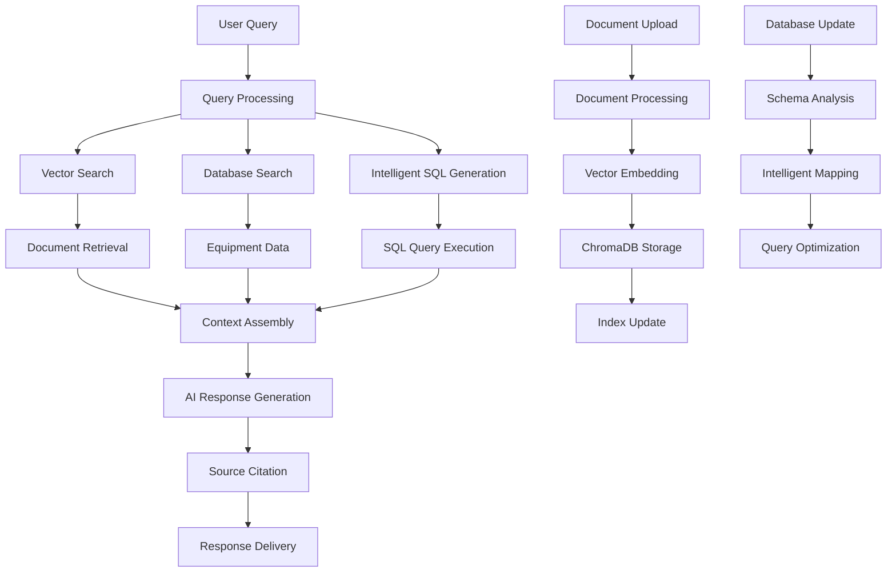

# RAG System - Complete Documentation

## 🤖 Project Overview

**Project Name:** RAG System (Retrieval Augmented Generation)  
**Project Type:** AI-Powered Chatbot and Document Search System  
**Technology Stack:** Python with Multiple AI and Vector Database Libraries  
**Purpose:** Intelligent document search and Q&A system for equipment management  
**Development Status:** Production Ready with Advanced Features  

## 🎯 What This Project Does

The RAG System is a sophisticated AI-powered chatbot that combines document search, database queries, and artificial intelligence to provide intelligent answers about equipment, maintenance, and technical information.

### Key Features:
1. **Document Search** - Search through thousands of documents using vector similarity
2. **Database Integration** - Query SQL databases for equipment information
3. **AI Chatbot** - Intelligent conversation using Large Language Models
4. **Hybrid Search** - Combines document and database search for comprehensive results
5. **Vanna AI Integration** - Advanced SQL generation and database interaction
6. **Real-time Processing** - Live document processing and indexing
7. **Analytics Dashboard** - Comprehensive system monitoring and analytics

### Core Capabilities:
- **Intelligent Q&A**: Answer complex questions about equipment and maintenance
- **Document Correlation**: Find relevant documents based on queries
- **Database Queries**: Generate and execute SQL queries automatically
- **Equipment Management**: Track and manage equipment information
- **Project Correlation**: Link equipment to specific projects
- **Cost Tracking**: Monitor API usage and costs

## 🏗️ Technical Architecture

### Technology Stack:
- **Core Language**: Python 3.x
- **Web Framework**: Streamlit for user interface
- **Vector Database**: ChromaDB for document embeddings
- **SQL Database**: SQL Server for equipment data
- **AI Services**: 
  - OpenAI API (GPT-4, GPT-3.5-turbo)
  - Vanna AI for SQL generation
  - ChromaDB for vector search
- **Document Processing**: 
  - PyMuPDF for PDF processing
  - LangChain for document handling
  - Scikit-learn for machine learning
- **Data Processing**: Pandas, NumPy for data manipulation

### Project Structure:
```
RAG/
├── RAG/                          # Main RAG system directory
│   ├── vector_store.py           # Vector database management
│   ├── sql_manager.py            # SQL database operations
│   ├── document_processor.py     # Document processing and indexing
│   ├── intelligent_sql.py        # AI-powered SQL generation
│   ├── vanna_hybrid.py          # Vanna AI integration
│   └── complete_rag_engine.py    # Main RAG engine
├── logs/                         # Processing and error logs
├── .venv/                        # Python virtual environment
├── .vscode/                      # VS Code configuration
├── completed_files.txt           # Processed files tracking
└── RAG.sln                       # Solution file
```

## 🔧 Working Principles

### 1. Retrieval Augmented Generation (RAG)
The system implements a sophisticated RAG architecture:

**Document Processing**:
- Converts documents to vector embeddings
- Stores embeddings in ChromaDB vector database
- Enables semantic search across document content
- Maintains document metadata and relationships

**Query Processing**:
- Converts user queries to vector embeddings
- Performs similarity search in vector database
- Retrieves relevant document chunks
- Combines with database queries for comprehensive results

**Response Generation**:
- Uses retrieved information as context
- Generates responses using Large Language Models
- Provides source citations and references
- Maintains conversation context and history

### 2. Hybrid Search Architecture
The system combines multiple search methods:

**Vector Search**:
- Semantic similarity search in document embeddings
- Finds conceptually related content
- Handles synonyms and related terms
- Provides relevance scoring

**Database Search**:
- Direct SQL queries for structured data
- Equipment information and specifications
- Project and maintenance records
- Real-time data access

**Intelligent Correlation**:
- Links documents to database records
- Identifies relationships between data sources
- Provides comprehensive context
- Enables cross-referencing

### 3. AI-Powered Intelligence
The system uses multiple AI models for different tasks:

**OpenAI GPT Models**:
- GPT-4 for complex reasoning and analysis
- GPT-3.5-turbo for faster, simpler tasks
- Whisper for audio transcription
- Embeddings for vector search

**Vanna AI Integration**:
- Specialized SQL generation
- Database schema understanding
- Query optimization
- Error handling and correction

**Custom AI Components**:
- Document classification
- Equipment type detection
- Project number extraction
- Priority scoring

## 📊 Data Flow



## 🚀 Getting Started

### Prerequisites:
- Python 3.7 or higher
- SQL Server database access
- OpenAI API key
- Required Python packages

### Installation Steps:

1. **Install Python packages**
   ```bash
   pip install streamlit openai chromadb langchain
   pip install pandas numpy scikit-learn
   pip install vanna tiktoken
   pip install PyMuPDF psutil
   ```

2. **Configure environment variables**
   ```bash
   # Create .env file with:
   OPENAI_API_KEY=your-openai-api-key
   DATABASE_CONNECTION_STRING=your-database-connection
   CUSTOMER_FOLDER=path-to-documents
   ```

3. **Set up database**
   - Ensure SQL Server database is accessible
   - Verify table structure and permissions
   - Test database connection

4. **Prepare documents**
   - Place documents in specified folder
   - Ensure proper file formats (PDF, DOC, TXT)
   - Organize by project or equipment type

5. **Run the application**
   ```bash
   streamlit run chatbot.py
   ```

## 🔧 Core Components

### 1. Main Application (`chatbot.py`)
The primary Streamlit application with comprehensive functionality:

**Key Features**:
- Interactive chat interface
- Document processing controls
- Database management tools
- Analytics and monitoring
- Vanna AI integration

**User Interface**:
- Clean, professional design
- Multiple tabs for different functions
- Real-time processing updates
- Comprehensive error handling

### 2. Complete RAG Engine (`complete_rag_engine.py`)
The core RAG system that orchestrates all components:

**Functions**:
- Document processing and indexing
- Vector search and retrieval
- Database query execution
- AI response generation
- Result correlation and ranking

**Architecture**:
- Modular component design
- Scalable processing pipeline
- Error handling and recovery
- Performance optimization

### 3. Vector Store (`vector_store.py`)
Manages document embeddings and vector search:

**Features**:
- Document embedding generation
- ChromaDB integration
- Similarity search
- Metadata management
- Performance optimization

**Capabilities**:
- Batch document processing
- Incremental updates
- Query optimization
- Result ranking

### 4. SQL Manager (`sql_manager.py`)
Handles database operations and queries:

**Functions**:
- Database connection management
- Query execution
- Result processing
- Schema analysis
- Performance monitoring

**Features**:
- Intelligent query generation
- Error handling and recovery
- Connection pooling
- Result caching

### 5. Document Processor (`document_processor.py`)
Processes and indexes documents:

**Features**:
- Multi-format document support
- Text extraction and cleaning
- Chunking and embedding
- Metadata extraction
- Progress tracking

**Supported Formats**:
- PDF documents
- Word documents
- Text files
- HTML files

### 6. Intelligent SQL (`intelligent_sql.py`)
AI-powered SQL generation and execution:

**Features**:
- Natural language to SQL conversion
- Query optimization
- Error handling and correction
- Result validation
- Performance monitoring

### 7. Vanna AI Hybrid (`vanna_hybrid.py`)
Advanced AI integration for database operations:

**Features**:
- Specialized SQL generation
- Database schema understanding
- Query optimization
- Cost tracking
- Performance analytics

## 📋 Key Features

### 1. Intelligent Chat Interface
- **Natural Language Processing**: Understands complex queries
- **Context Awareness**: Maintains conversation context
- **Source Citations**: Provides references for all information
- **Multi-turn Conversations**: Handles follow-up questions

### 2. Document Search and Retrieval
- **Semantic Search**: Finds conceptually related content
- **Vector Similarity**: Uses AI embeddings for search
- **Metadata Filtering**: Search by document type, project, equipment
- **Relevance Ranking**: Prioritizes most relevant results

### 3. Database Integration
- **Equipment Management**: Track equipment information
- **Project Correlation**: Link equipment to projects
- **Maintenance Records**: Access service history
- **Real-time Data**: Live database queries

### 4. Hybrid Search Capabilities
- **Combined Results**: Merge document and database results
- **Intelligent Correlation**: Link related information
- **Comprehensive Coverage**: Search across all data sources
- **Contextual Understanding**: Provide complete context

### 5. AI-Powered Processing
- **Multiple AI Models**: GPT-4, GPT-3.5, Vanna AI
- **Specialized Tasks**: Different models for different functions
- **Cost Optimization**: Efficient model usage
- **Performance Monitoring**: Track usage and costs

### 6. Analytics and Monitoring
- **System Health**: Monitor all components
- **Performance Metrics**: Track processing speed and accuracy
- **Cost Analysis**: Monitor API usage and costs
- **User Analytics**: Track usage patterns and preferences

## 🛠️ Configuration

### Environment Variables:
```python
# OpenAI Configuration
OPENAI_API_KEY = "your-openai-api-key"

# Database Configuration
DATABASE_CONNECTION_STRING = "your-database-connection-string"

# Document Configuration
CUSTOMER_FOLDER = "path-to-documents"
VECTOR_STORE_TYPE = "chromadb"

# Performance Configuration
MAX_DOCUMENTS = 1000
CHUNK_SIZE = 1000
CHUNK_OVERLAP = 200
```

### Database Configuration:
```python
# SQL Server Connection
SERVER = "vdrsapps.database.windows.net"
DATABASE = "PowerAppsDatabase"
USERNAME = "VDRSAdmin"
PASSWORD = "your-password"
```

### AI Model Configuration:
```python
# OpenAI Models
GPT4_MODEL = "gpt-4"
GPT35_MODEL = "gpt-3.5-turbo"
EMBEDDING_MODEL = "text-embedding-ada-002"

# Vanna AI Configuration
VANNA_MODEL = "vanna-ai/vanna-ai"
VANNA_API_KEY = "your-vanna-api-key"
```

## 📊 Data Processing

### 1. Document Processing Workflow
1. **Document Discovery**: Scan folder for new documents
2. **Format Detection**: Identify document type and format
3. **Text Extraction**: Extract text content from documents
4. **Chunking**: Split text into manageable chunks
5. **Embedding**: Generate vector embeddings for chunks
6. **Storage**: Store embeddings in ChromaDB
7. **Indexing**: Update search indexes

### 2. Query Processing Workflow
1. **Query Analysis**: Understand user intent and requirements
2. **Vector Search**: Find relevant document chunks
3. **Database Query**: Generate and execute SQL queries
4. **Result Correlation**: Link document and database results
5. **Context Assembly**: Combine all relevant information
6. **Response Generation**: Generate comprehensive response
7. **Source Citation**: Provide references and sources

### 3. AI Response Generation
1. **Context Preparation**: Assemble relevant information
2. **Prompt Engineering**: Create effective prompts for AI
3. **Model Selection**: Choose appropriate AI model
4. **Response Generation**: Generate comprehensive response
5. **Quality Validation**: Check response quality and accuracy
6. **Source Integration**: Include source citations
7. **Delivery**: Present response to user

## 🔍 User Interface

### 1. Main Chat Interface
- **Chat Input**: Natural language query input
- **Response Display**: Formatted responses with sources
- **Source Citations**: Expandable source references
- **Conversation History**: Previous queries and responses

### 2. Document Management
- **Processing Controls**: Start/stop document processing
- **Progress Tracking**: Real-time processing updates
- **File Management**: Upload and organize documents
- **Status Monitoring**: Processing status and errors

### 3. Database Management
- **Connection Testing**: Test database connectivity
- **Schema Analysis**: View database structure
- **Query Execution**: Run custom SQL queries
- **Result Display**: View query results

### 4. Analytics Dashboard
- **System Health**: Monitor all components
- **Performance Metrics**: Track processing speed
- **Cost Analysis**: Monitor API usage and costs
- **User Analytics**: Track usage patterns

### 5. Vanna AI Interface
- **SQL Generation**: Generate SQL from natural language
- **Query Optimization**: Optimize database queries
- **Cost Tracking**: Monitor Vanna AI usage
- **Performance Analytics**: Track query performance

## 🧪 Testing and Validation

### Unit Testing:
- Test individual components and functions
- Test AI model integrations
- Test database operations
- Test document processing

### Integration Testing:
- Test end-to-end workflows
- Test multi-component interactions
- Test error handling and recovery
- Test performance under load

### User Acceptance Testing:
- Test user interface and experience
- Test different query types
- Test response quality and accuracy
- Test system reliability

## 🚀 Deployment

### Development Environment:
1. **Local Setup**: Install dependencies and configure
2. **Database Setup**: Configure local database
3. **API Keys**: Set up OpenAI and Vanna AI access
4. **Testing**: Run comprehensive test suite

### Production Environment:
1. **Server Setup**: Configure production server
2. **Database Setup**: Set up production database
3. **Security**: Implement security measures
4. **Monitoring**: Set up logging and monitoring

## 🔮 Future Enhancements

### Planned Features:
- Mobile app version
- Advanced analytics
- Multi-language support
- Integration with more systems

### Technical Improvements:
- Performance optimization
- Enhanced AI models
- Better error handling
- Additional data sources

## 🐛 Known Issues

### Current Limitations:
- Requires internet connection for AI services
- Limited offline functionality
- High computational requirements
- API cost considerations

### Technical Debt:
- Need for better error handling
- Limited logging capabilities
- Basic performance monitoring
- Manual configuration required

## 📞 Support and Maintenance

### Development Team:
- Primary Developer: Ajith Srikanth
- AI Specialist: OpenAI Integration Team
- Database Administrator: VDRS Team

### Maintenance Schedule:
- Regular updates for bug fixes
- Feature releases every quarter
- Security updates as needed
- Performance optimizations

## 📚 Additional Resources

### Documentation:
- OpenAI API Documentation
- ChromaDB Documentation
- Vanna AI Documentation
- Streamlit Documentation

### Tools:
- AI model testing tools
- Database management tools
- Performance monitoring tools
- Cost tracking tools

---

*This documentation provides a comprehensive understanding of the RAG System, explaining both the technical implementation and practical usage in terms accessible to someone transitioning from high school to university level.*
